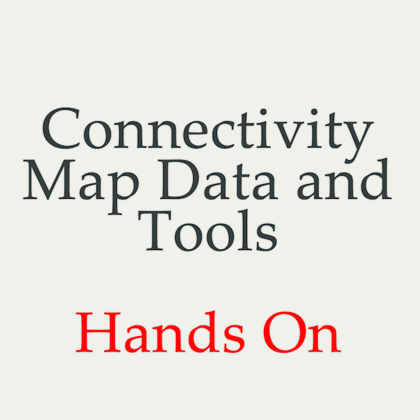
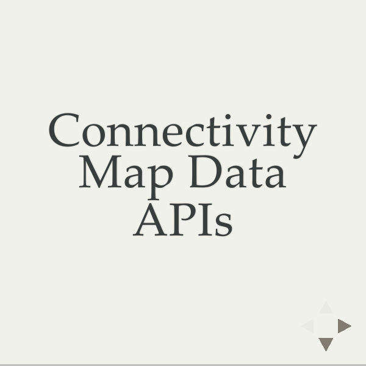

# Soap Box
These are public domain talks.  Use them, fork them, whatever!  I'm open to you improving these and sending me pull requests.  

# Talk List
## CMAP Hands On for Power Users

[view on GitHub](https://github.com/coreyflynn/SoapBox/tree/gh-pages/DataAPI)

## CMAP Data API 

[view on GitHub](https://github.com/coreyflynn/SoapBox/tree/gh-pages/DataAPI)

## PostDoc CMAP Bootcamp

[view on GitHub](https://github.com/coreyflynn/SoapBox/tree/gh-pages/PDBootcampCMap)

## Processing Tutorial 

[view on GitHub](https://github.com/coreyflynn/SoapBox/tree/gh-pages/BroadEProcessing)
